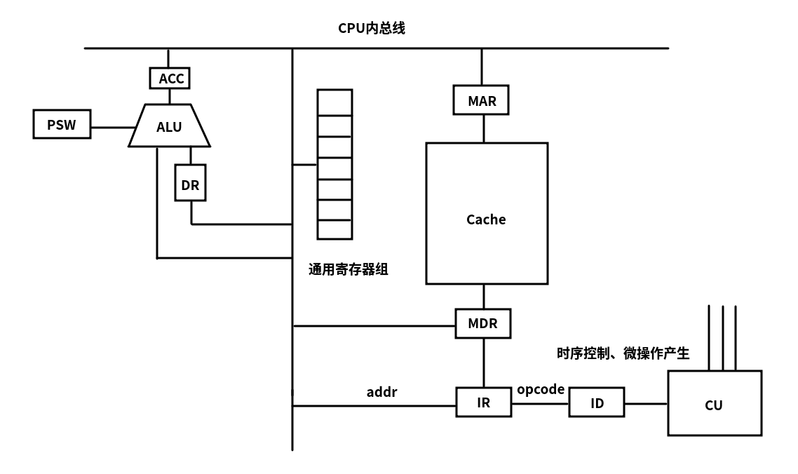

# CPU组成

+ cpu
    + 运算器
        + ALU
        + ACC
        + DR
        + 通用寄存器组
        + PSW
    + 控制器
        + PC、MAR、MDR、IR
        + ID（指令译码器）
        + CU（控制存储器）
        + 时序电路、微操作发生器

# 寄存器和暂存器

+ 寄存器
    + 通用寄存器组
    + PSW
+ 暂存器
    + ACC
    + DR
    + IR
    + PC

# 各个部件的作用

+ DR

暂存即将交付给ALU的数据，将不同时间段内读写的数据隔离开来。

+ ACC

暂存ALU计算的结果

# CPU内部结构图

