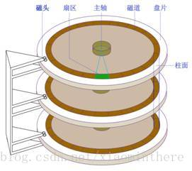

磁盘总体结构：一个磁盘由多个盘片构成，每个盘片有两个盘面，每个盘面有一个磁头(head)。
每个盘面从内到外由一个个磁道(track)构成，所面盘面的相同磁道共同构成一个柱面(cylinder)，
每个磁道中有多个扇区(sector)，扇区是磁盘管理的基本单位。一个或多个扇区组成一个簇，簇
为操作系统进行文件存储分配的基本单位。

磁盘的地址分为两种：LBA(logical block address)和CHS(cylinder head sector)，其中LBA为
一维线性地址，CHS为磁盘控制器实际对磁盘进行读取和写入时使用的地址。
