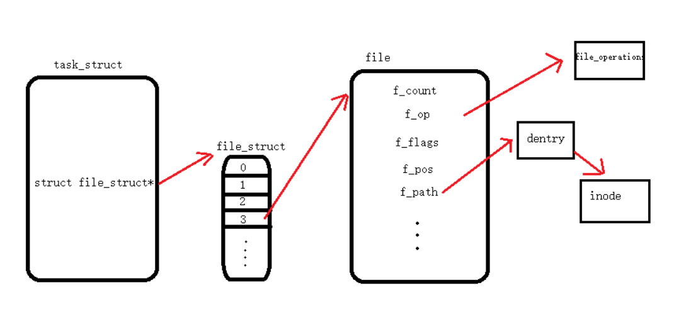

每个进程都有一个文件描述符表，通过文件描述符(file descriptor)可以访问相应的file struct，
通过系统调用`open`可以获得相应文件的fd，并且从磁盘中读入文件的FCB，通过系统调用`write`可以
读入文件内容至内存。

其中`open`需要的参数有：文件名及路径，返回相应的文件描述符，`read`需要的参数有文件描述符、
读入的缓冲区地址、读入的长度。

不同进程打开相同文件后会创建不同的file struct，但file struct中的某个项目(f_path)会指向相同的inode，
文件的读写指针(f_pos)保存在file struct中，由不同的进程各自维护。
