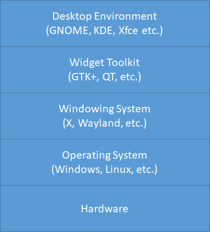
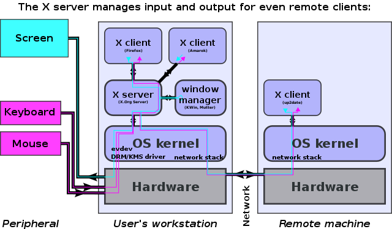

# relations between different some concepts

## windowing system

windowing system is a software that manages different part of display screens.
It's a part of GUI(graphical user interface) which implements WIMP(windows,
icons, menus, pointers).

The core of window system is window server which communicate with clients(opened
windows are all clients to window server) through window system protocol. It
receives all the input from kernel and transimits it to certain clinet. 

From a programmer's perspective, a window system implements graphical prmitive
such as font rendering and window drawing and positioning. It provides an
abstraction of the graphics hardware for use by higher-level elements of the
graphical interface such as a window manager.

**Unix window system**

+ X window system
+ wayland
+ twein

## widget toolkit

X does not mandate the user interface – this is handled by individual programs.
As such, the visual styling of X-based environments varies greatly; different
programs may present radically different interfaces.

Widget toolkit is a capsulation to the X library and add some features. So the
programs wriiten in the same toolkit always share the similiar UI.

**Unix widget toolkit**

+ qt
+ gtk

## desktop enviroment

A desktop enviroment is a bunch of programs which are mostly written in the same
widget toolkit and shares the similiar UI.

# Then what about X

X, X11, X window system are synonyms. The all stand for x window system.

xorg is the organization which develops X.
