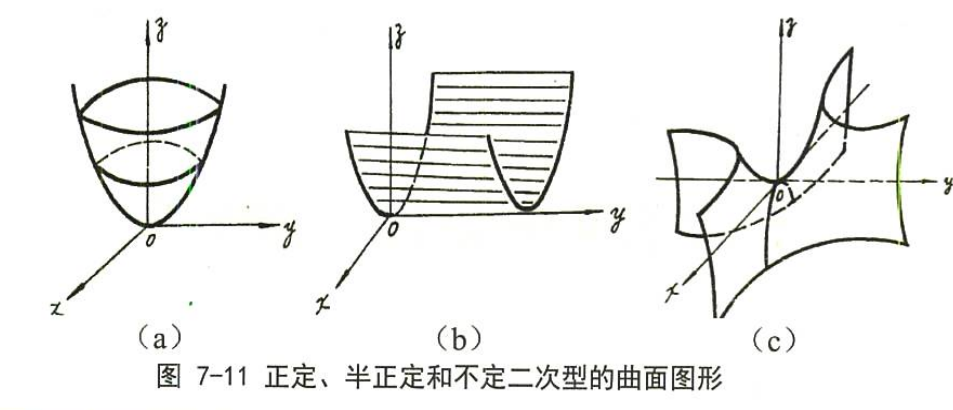
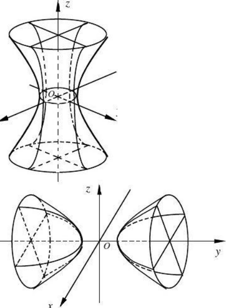

# 线性代数的几何意义

### 行列式

行列式有两种理解方式

- 线性变换的伸缩因子
- 行列式对应矩阵所构成的多面体的有向面积或有向体积

### 矩阵的秩

矩阵的秩是矩阵的列向量或行向量张成空间的维数。

### 矩阵的运算

- 矩阵乘法

矩阵乘法是线性变换的复合。

矩阵与矩阵相乘可以看作向量组与矩阵相乘。AB表示对A的列向量组进行线性变换，表示对B的行向量进行线性变换。

- 矩阵的逆

矩阵的逆是对应线性变换的反变换，因为线性投影不存在逆变换，所以对于矩阵 A，若 $R(A) \lt A$，则 A 不可逆。

### 线性变换

线性变换有两种理解方式，不管以哪种方式进行线性变换图形的绝对变换方式都是相同的

- 坐标不变对坐标系进行线性变换，对应的矩阵叫做坐标变换矩阵
- 在同一基下对坐标进行线性变换，对应的矩阵叫做基变换矩阵

在二维空间中，基变换矩阵将正交基张成的正方形转换成平行四边形。
在三维空间中，基变换矩阵将正交基张成的正方体转换成平行六面体。

```
若基过渡矩阵为P = (pij)
(β1, β2, ... , βn) = (α1, α2, ... , αn) P
(β1, β2, ... , βn) = (T(α1), T(α2), ... , T(αn))  T: transformation
B = AP
对应坐标
(b1, b2, ... ,bn)^T = P^(-1)(a1, a2, ... , an)^T
```

### 向量组

向量可以由向量组线性表示

- 向量位于向量组的极大无关组张成的线性子空间中。
- R(A) = R(A, b)

向量组 A 可以由向量组 B 线性表示

- 向量组 A 的子空间被包含于向量组 B 的子空间。
- R(B) = R(B, A)

两个向量组等价

- 两个向量组张成的线性子空间相同。
- R(A) = R(B) = R(A, B)

向量组线性相关

- 向量个数大于子空间维数。
- $R(A) \lt n$ 

向量组线性无关

- 向量个数等于空间维数
- R(A) = n

行向量组张成的线性空间与列向量组张成的线性空间没有关系。

### 等价、相似、合同

等价矩阵：一个线性映衬在两个向量空间上的不同基下下的线性变换。

> 线性映衬是不依赖于坐标系的绝对变换方式，线性变换依赖于坐标系。

相似矩阵：一个线性映衬在同一向量空间上的不同基下的表现。

### 特征值与特征向量

矩阵对它的特征向量只做伸缩变换，特征值是伸缩倍数。

对于某一个特征值，它的特征空间的维数等于其特征向量组的秩，可以是 1 条直线、一个平面或者一个 n 维空间。

特征值的代数重数：特征值求解因式中的次数。
特征值的几何重数：特征值的特征向量子空间的维数。
代数重数 ≥ 几何重数

### 二次型

1、二次型和正交变换的几何意义

方程$ f(x_1, x_2, \cdots, x_n) $对应空间中某个几何图形，其中图形的几何形状只与其中的二次项有关，
所以我们可以依次消去一次项和交叉项来研究图形的几何意义，其中消去一次项相当于对图形做平移变换，
得到的方程即我们需要研究的二次型$ \vec x^{\mathrm{T}}A\vec x $，然后再对二次型进行正交变换，得到标准型，
相当于对图形做旋转变换，即可判断图形的形状。

其中$ f(x_1, x_2) $表示三维空间中的几何图形，而$ f(x_1, x_2) = d $ 表示对三维图形的切片，得到的是二维空间中二次曲面。
以此类推，$ f(x_1, x_2, x_3) $表示四维空间中的几何图形，而$ f(x_1, x_2, x_3) = d $ 表示对四维图形的切片，得到的是
三维空间中的二次曲面。

2、惯性定理的几何意义

> 惯性定理：通过不同的正交变换得到的标准型中的二次项系数中的正数、零、负数的个数是相同的。

因为图形的形状由二次项系数决定，而正交变换不改变图形的形状，所以系数的类型也不会改变。

3、二次型的正定性的几何意义

> 设有二次型$ f(x) = \vec x^{\mathrm{T}}A \vec x $
> 正定： $ \forall \vec x \ne \vec 0, 都有f(x) > 0 $
> 半正定： $ \forall \vec x \ne \vec 0, 都有f(x) \ge 0 $ 



4、正定性判定的直观理解

+ 方法1：将矩阵进行对角化，如果主对角线的元素全部大于0，则正定，如果全部小于0，则负定。

+ 方法2：若主子式全部大于0，则正定；如果奇数阶主子式为负，偶数阶主子式为正，则负定 → 考虑正交变换后的矩阵。

5、二次型$ f(x_1, x_2, \cdots, x_n) = d $的几何意义 

表示对二次所代表的空间图形的切片，可以先做正交变换使得$ f(x_1, x_2, \cdots, x_n) = f(y_1, y_2, \cdots, y_n) = y_1^2 +
y_2^2 + \cdots + y_n^2 $，然后研究$ y_1^2 + y_2^2 + \cdots + y_n^2 = d $的几何意义。 

+ 对于二次标准型$ diag(y_1^2, y_2^2) $，下列$ k_1、k_2 $均大于0 

| 二次型切片最后方程          | 二次曲面类型 |
| :-:                         | :-:          |
| $ k_1y_1^2 + k_2y_2^2 = 1 $ | 椭圆         |
| $ k_1y_1^2 - k_2y_2^2 = 1 $ | 双曲面       |
| $ k_1y_1^2 + k_2y_2^2 = 0 $ | 两条相交直线 |
| $ k_1y_1^2 = 1 $            | 平行两直线   |
| $ k_1y_1^2 = 0 $            | 重合两直线   |

+ 对于二次标准型$ diag(y_1^2, y_2^2, y_3^2) $，下列$ k_1, k_2, k_3 $均大于0 

将$ k_1, k_2, k_3 $看作$ x, y, z $，某些变量不存在于方程中是表示可以取任意值。

| 二次型切片最后方程            | 二次曲面类型 |
| :-:                           | :-:          |
| $ k_1^2 + k_2^2 + k_3^2 = 1 $ | 椭球面       |
| $ k_1^2 + k_2^2 - k_3^2 = 1 $ | 单叶双曲面   |
| $ k_1^2 - k_2^2 - k_3^2 = 1 $ | 双叶双曲面   |
| $ k_1^2 + k_2^2 - k_3^2 = 0 $ | 圆锥面       |
| $ k_1^2 + k_2^2 = 1 $         | 椭圆柱面     |
| $ k_1^2 + k_2^2 = 0 $         | 一条直线     |
| $ k_1^2 - k_2^2 = 1 $         | 双曲柱面     |
| $ k_1^2 - k_2^2 = 0 $         | 两相交平面   |
| $ k_1^2 = 1 $                 | 一对平行面   |
| $ k_1^2 = 0 $                 | 一对重合面   |
| (0, 0, 0)                     | 坐标原点     |

+ 单叶双曲面、双叶双曲面



上图为单叶双曲面，可以记忆为广州塔，下图为双叶双曲面，可以记忆为磁铁。
