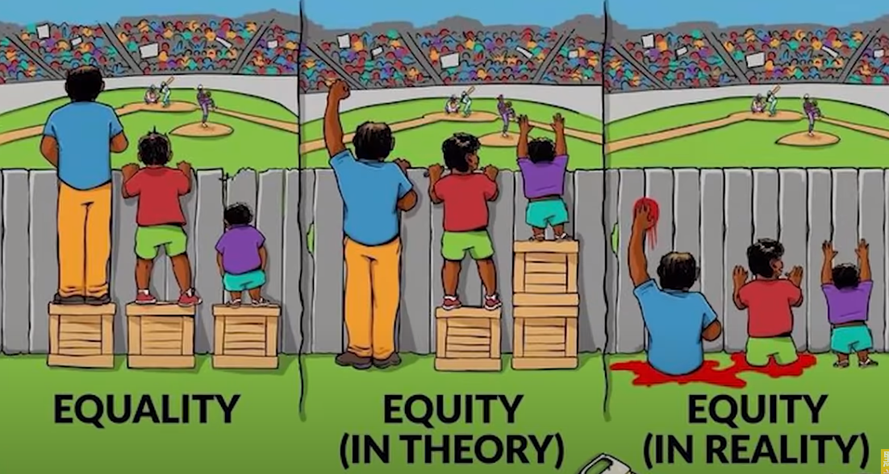

真正的公平：让不同天赋、起点、努力、机遇的人，在人生的不同高度处都能看到各自的风景和社会的善意。

虚假的公平：掠夺其他登得更高的人的资源来让所有人能爬到同一个高度。

True fairness: Let people with different talents, starting points, efforts and
opportunities see their own scenery and the goodwill of society at different heights
of life.

False justice: plunder the resources of other people who have climbed higher so
that everyone can climb to the same height.

